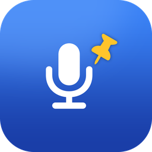
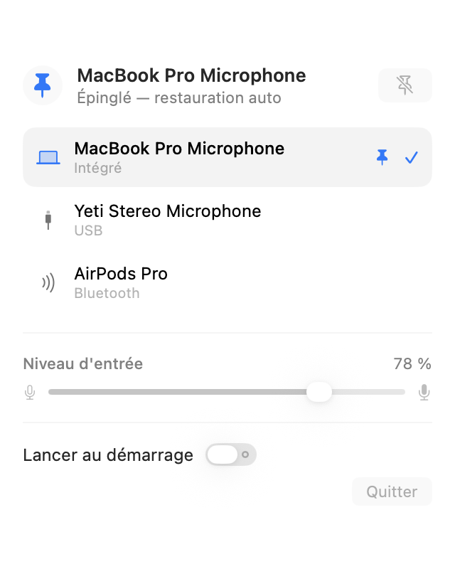

<p align="center">
  
</p>

<h1 align="center">MicPin</h1>

<p align="center"><a href="README.md">English version</a></p>

Un petit utilitaire de barre des menus pour macOS qui épingle votre micro d'entrée et son volume, pour que macOS cesse de les changer dans votre dos.



## Le problème

macOS promeut spontanément tout nouveau périphérique audio en entrée par défaut. Vous branchez des écouteurs, vous appairez un casque Bluetooth, une app ouvre un périphérique virtuel — et votre micro intégré n'est plus celui qui capte. Pire : chaque périphérique conserve son propre niveau d'entrée, donc le volume change en même temps que la source.

On s'en aperçoit généralement au milieu d'un appel, quand quelqu'un demande pourquoi on l'entend mal.

MicPin corrige les deux : il épingle le micro **et** son volume, et les restaure dès que macOS s'en écarte.

## Fonctionnalités

- **Choisir sa source** — tous les micros disponibles dans un menu, avec leur type de connexion.
- **Régler le niveau d'entrée** — un curseur, sans passer par les Réglages Système.
- **Épingler un micro** — MicPin surveille les bascules et remet aussitôt le périphérique voulu et son volume.
- **Léger** — application native SwiftUI, aucun driver audio virtuel, aucune dépendance externe.
- **Discret** — vit dans la barre des menus, pas d'icône dans le Dock.
- **Garder le micro éveillé** — supprime la latence de reprise des casques Bluetooth, le temps d'une visioconférence.
- **À jour** — vérifie une fois par jour s'il existe une nouvelle version, et n'installe que ce qui est signé par l'auteur.

## Installation

Téléchargez le disque d'installation depuis la [dernière version publiée](https://github.com/dimer47/MicPin/releases/latest), puis glissez MicPin dans le dossier Applications.

L'application est signée et notarisée par Apple : aucun avertissement de sécurité au premier lancement.

L'emplacement compte : `SMAppService` refuse d'enregistrer le lancement au démarrage pour une app située ailleurs que dans `/Applications`.

**Prérequis** : macOS 26 ou ultérieur.

### Compiler depuis les sources

```bash
git clone https://github.com/dimer47/MicPin.git
cd MicPin
xcodebuild -project MicPin.xcodeproj -scheme MicPin -configuration Release build
```

Xcode 26 est nécessaire. Pour lancer les tests : remplacez `build` par `test`.

## Utilisation

**Clic gauche** sur l'icône — le panneau des micros :

1. Choisissez votre micro dans la liste.
2. Réglez le niveau d'entrée au curseur.
3. Cliquez sur l'épingle pour verrouiller ce micro et son volume.
4. Activez « Garder le micro éveillé » avant un appel, coupez-le après.

**Clic droit** (ou Contrôle-clic) — les réglages :

- Lancer au démarrage
- Rechercher les mises à jour, et vérifier maintenant
- Quitter

Cette répartition suit la convention macOS : l'usage courant à gauche, la configuration à droite.

Une fois épinglé, l'icône de la barre change et MicPin restaure votre choix à chaque tentative de bascule de macOS. Cliquez de nouveau sur l'épingle pour lever le verrouillage.

### Si l'icône n'apparaît pas

Une barre des menus saturée empêche macOS d'attribuer un emplacement visible aux nouveaux éléments. Libérez de la place en faisant glisser une icône hors de la barre avec la touche Cmd enfoncée, ou utilisez un gestionnaire de barre des menus.

### Garder le micro éveillé

macOS ferme le flux audio dès que plus aucune application ne l'utilise, et le micro s'endort. La reprise coûte une latence, nettement perceptible en Bluetooth où le casque doit renégocier son profil : le début d'une phrase est parfois avalé.

L'interrupteur maintient un flux ouvert pour éviter ça. Il est **coupé par défaut et manuel**, parce qu'il a un coût :

- Le voyant orange de micro reste allumé tant qu'il est actif — macOS l'affiche dès qu'un flux d'entrée existe, aucune application ne peut le désactiver.
- La radio Bluetooth ne se met plus en veille, ce qui consomme des deux côtés.

Aucun son n'est enregistré ni transmis : le flux est lu puis jeté, seule sa présence garde le périphérique éveillé.

## Détails techniques

Trois décisions valent d'être expliquées, parce qu'elles ne sont pas évidentes à la lecture.

**La persistance se fait par UID, pas par identifiant de périphérique.** L'`AudioObjectID` que CoreAudio attribue à un périphérique change à chaque rebranchement. L'UID, lui, survit aux redémarrages : c'est donc lui qui est mémorisé, ce qui permet à l'épinglage de tenir quand vous débranchez puis rebranchez le micro.

**La reprise en main est bornée.** Si un périphérique refusait obstinément de rester sélectionné, réécrire l'entrée par défaut en boucle ferait tourner l'app indéfiniment contre CoreAudio. MicPin limite les restaurations à cinq par tranche de dix secondes, puis met la reprise en pause le temps d'une fenêtre. L'épinglage lui-même est conservé : une rafale de notifications, au réveil de veille par exemple, ne doit jamais effacer le réglage de l'utilisateur.

**Le curseur de volume se grise sur certains micros.** Beaucoup de périphériques USB et Bluetooth n'exposent pas `kAudioDevicePropertyVolumeScalar` en écriture : leur gain est géré par le matériel. MicPin détecte le cas et l'explique, plutôt que de laisser un contrôle inerte.

### Architecture

| Fichier | Rôle |
|---|---|
| `CoreAudioBridge.swift` | Accès bas niveau à CoreAudio : énumération, lecture et écriture des propriétés, observateurs |
| `MicrophoneController.swift` | État de l'app et logique d'épinglage |
| `AudioDevice.swift` | Description d'un périphérique d'entrée |
| `Preferences.swift` | Persistance et lancement au démarrage |
| `MenuContentView.swift` | Le panneau de la barre des menus |
| `MenuBarIcon.swift` | Fabrication de l'icône de la barre |
| `StatusItemController.swift` | Élément de barre : clic gauche et clic droit |
| `MicrophoneKeepAlive.swift` | Maintien du micro éveillé |
| `UpdateChecker.swift` | Recherche et installation des mises à jour |

L'app n'est pas en bac à sable : lire et modifier les périphériques audio du système l'exige.

## Contribuer

Les tests s'exécutent avec `xcodebuild -project MicPin.xcodeproj -scheme MicPin test`, et à chaque poussée via GitHub Actions.

La procédure de publication est décrite dans [docs/publication.md](docs/publication.md).

## Licence

GPL-3.0. Voir [LICENSE](LICENSE).
